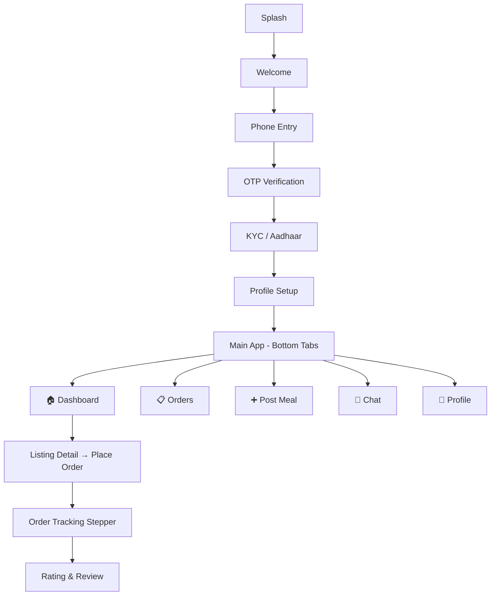

# ShareMyMeal — Project Walkthrough

## Overview
A hyperlocal peer-to-peer food marketplace connecting neighbors for home-cooked meal transactions. Built with **FastAPI** (backend) + **React Native / Expo** (mobile).

## Project Structure

```
ShareMyMeal/
├── backend/                    # FastAPI server
│   ├── app/
│   │   ├── main.py             # Entry point, CORS, routers
│   │   ├── config.py           # Environment vars (Pydantic Settings)
│   │   ├── firebase_admin_init.py
│   │   ├── models/             # Pydantic schemas
│   │   │   ├── user.py, listing.py, order.py, payment.py
│   │   ├── services/           # Business logic
│   │   │   ├── kyc_service.py, payment_service.py,
│   │   │   ├── notification_service.py, location_service.py
│   │   ├── routers/            # API endpoints
│   │   │   ├── auth.py, listings.py, orders.py,
│   │   │   ├── payments.py, ratings.py, notifications.py
│   │   └── utils/              # Geohash, validators
│   ├── .env                    # API keys (placeholder)
│   └── requirements.txt
│
└── mobile/                     # React Native (Expo Go)
    ├── App.js
    └── src/
        ├── config/firebase.js
        ├── navigation/AppNavigator.js
        ├── components/SharedComponents.js
        ├── services/api.js
        ├── utils/theme.js
        └── screens/
            ├── auth/       → Splash, Welcome, Phone, OTP, KYC, ProfileSetup
            ├── home/       → Dashboard, ListingDetail
            ├── orders/     → OrderTracking, MyOrders, Rating
            ├── seller/     → PostMeal
            ├── chat/       → ChatScreen
            └── profile/    → MyProfile
```

---

## Backend (FastAPI)

### How to Run
```bash
cd D:\ShareMyMeal\backend
.venv\Scripts\activate
uvicorn app.main:app --reload --host 0.0.0.0 --port 8000
```

### Key Endpoints
| Route | Description |
|-------|-------------|
| `GET /health` | Service health + API key status |
| `POST /api/auth/profile` | Create user profile |
| `GET /api/listings/nearby` | Geohash-based local discovery |
| `POST /api/orders/` | Place an order |
| `PUT /api/orders/{id}/status` | Update order status (state machine) |
| `POST /api/payments/create-order` | Razorpay payment order |
| `POST /api/ratings/` | Submit seller rating |

### Verified
- ✅ Server starts on port 8000
- ✅ Health check returns status with service info
- ✅ Swagger docs at `/docs`

---

## Mobile App (Expo)

### How to Run
```bash
cd D:\ShareMyMeal\mobile
npx expo start
```
Scan QR code with **Expo Go** app on your phone.

### Screen Flow



### Design System
- **Dark mode** with warm orange (`#FF6B35`) + teal (`#1B998B`) palette
- Glassmorphism effects with translucent borders
- Premium card-based layouts with subtle shadows
- Color-coded status badges for order lifecycle

### 13 Screens Implemented
| Screen | Description |
|--------|-------------|
| Splash | Animated logo with spring animation |
| Welcome | Feature grid + hero CTA |
| Phone Entry | +91 prefix, 10-digit validation |
| OTP | 6-box input with auto-advance |
| KYC | 3-step Aadhaar flow with trust cards |
| Profile Setup | Photo, name, role (Buyer/Seller/Both) |
| Dashboard | Map preview, filter pills, listing cards |
| Listing Detail | Sample photo label, qty selector, order bar |
| Order Tracking | 6-step vertical stepper |
| My Orders | Active/History tabs |
| Chat | Real-time message bubbles |
| Post Meal | Seller form with payment toggles |
| My Profile | Stats, menu, settings |

---

## What's Next
1. **Connect Firebase** — Add real Firebase config keys
2. **Wire up API calls** — Connect screens to backend endpoints
3. **Test on device** — Scan Expo QR code with Expo Go
4. **Add Razorpay checkout** — Integrate payment SDK
